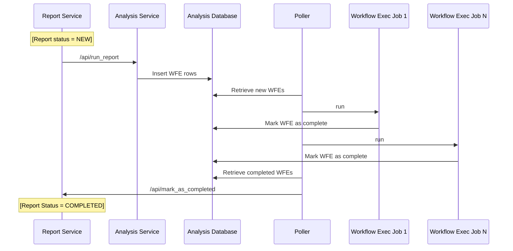
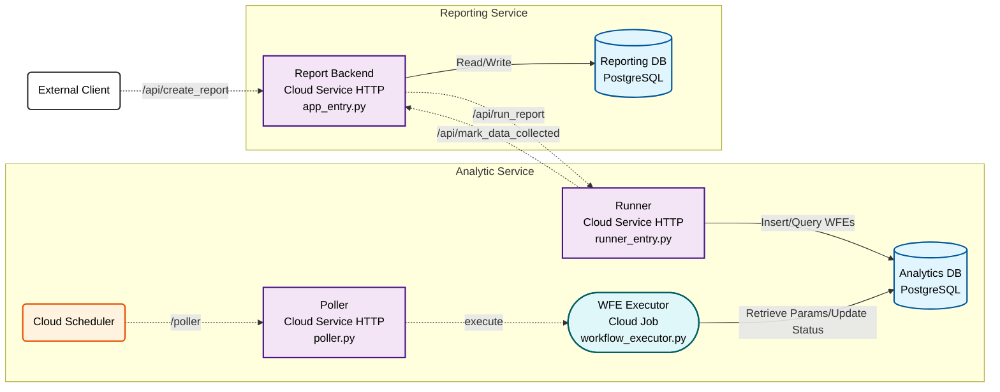

# Social Pulse

## License and Copyright Notice
> Copyright 2025 Google LLC
>
> Licensed under the Apache License, Version 2.0 (the "License");
> you may not use this file except in compliance with the License.
> You may obtain a copy of the License at
>
>   https://www.apache.org/licenses/LICENSE-2.0
>
> Unless required by applicable law or agreed to in writing, software
> distributed under the License is distributed on an "AS IS" BASIS,
> WITHOUT WARRANTIES OR CONDITIONS OF ANY KIND, either express or implied.
> See the License for the specific language governing permissions and
> limitations under the License.

## Disclaimer

> This project is provided "as is" and without warranty of any kind, express or
> implied, including but not limited to the warranties of merchantability,
> fitness for a particular purpose and non-infringement. In no event shall the
> authors or copyright holders be liable for any claim, damages or other
> liability, whether in an action of contract, tort or otherwise, arising from,
> out of or in connection with the software or the use or other dealings in the
> software.
>
> Please use this software at your own risk. The author(s) are not responsible
> for any legal implications or consequences resulting from the use or misuse of
> this software.

## Problem Statement

Many advertisers are well known world wide, where large groups of people express
strong opinions - both good and bad - about their products through social
content. Hence, many advertisers are looking to analyze social media content,
to find the following insights:

* Gauge this user sentiment, to see how it might be affecting their sales.
* Gauge what new features their customers are most interested in seeing added
to their products
* Monitor their respective industry, to help find emerging trends and emerging
competitors.


## Solution Description

This solution creates a platform by which advertisers can mine various social
media content (ie, Youtube videos and comments) to extract both 1) sentiment
scores on each piece of social media content, and 2) a relevancy score on how
much the content relates to the topic being analyzed.

The flow of the solution is as follows:

1. The analyzer identifies a topic (ie, "Foo feature for Bar product"), start
and end date to analyze, what social media content they want to analyze (see
details below), and what output they want (see details below).

2. When the solution runs, it will use publicly avaiable APIs to search for
content related to the topic, within the analysis start and end dates, and
from the specified social media content.

3. The solution will then leverage Google Cloud Platform's (GCP) Vertex AI
batch prediction capabilities to leverage Gemini to analyze all of the found
content.

4. Sentiment data is then written to a BigQuery table, where it can be queried
and analyzed.

## Architecture

### Overview


### Sequence Diagram - Running Reports


### GCP Architecture


## Deploying to Google Cloud

### Steps
1. Create or re-use a Google Cloud Project for deploying Social Pulse to.

2. If the haven't done it already, create an API key within the GCP project
   you're going to install Social Pulse into.

3. Download the code from the repository.

4. Update the `terraform.tfvars` file with the details for your project.

5. Run `deploy.sh` with the project ID of the GCP project you're installing
   Social Pulse onto.  For example:
   ```deploy.sh my-gcp-project```


### Creating a Sentiment Analysis Report

At the moment, the only way to create a sentiment report is via the command
line, by issuing an HTTP request directly to the reporting service to create
a report.  From there, the reporting and analysis service will coordinate
between themselves, scheduling the necessary workflow executions to generate
the data sets.  In order to create a report, you'll call the Reporting service
create report endpoint by posting a JSON request to the `/api/report` URL.

1. Authenticate yourself at the command line by running `gcloud auth login`.

2. Run the following commands to create a Share of Voice or a Sentiment Score
   report.

    ```shell
      # Share of Voice
      curl -X POST 'https://sp-reporting-api-[Your GCP Project NUMBER].[Project Location].run.app/api/report' \
        -H "Authorization: Bearer $(gcloud auth print-identity-token)" \
        -H 'Content-Type: application/json' \
        -d '{ "sources": [ "YOUTUBE_VIDEO" ], "data_output": "SHARE_OF_VOICE", "topic": "[Your Topic]", "start_time": "2024-12-01T00:00:00Z", "end_time": "2025-12-01T23:59:59Z", "include_justifications": false }'

      # Sentiment Scoring
      curl -X POST 'https://sp-reporting-api-[Your GCP NUMBER].[Project Location].run.app/api/report' \
        -H "Authorization: Bearer $(gcloud auth print-identity-token)" \
        -H 'Content-Type: application/json' \
        -d '{ "sources": [ "YOUTUBE_VIDEO" ], "data_output": "SENTIMENT_SCORE", "topic": [Your Topic], "start_time": "2024-12-01T00:00:00Z", "end_time": "2025-12-01T23:59:59Z", "include_justifications": true }'
    ```

3. Monitor the `ReportDataSet` table in the `reporting-database` PostgreSQL
   DB.  When the report is marked as `COMPLETE`, then the analysis workflows
   have been executed and the report dataset is ready to be queried:
   ```sql
    SELECT
      r.reportId,
      r.status,
      r.topic,
      rd.dataOutput,
      rd.outputUri
    FROM
      SentimentReports r
    LEFT OUTER JOIN
      SentimentReportDatasets rd
    ON
      r.reportId = rd.reportId
    ORDER BY
      r.createdOn DESC
    ;
   ```

4. Once completed, you can run the following queries in BigQuery to generate
   the share-of-voice or sentiment score reports.
   ```sql
    -- SOV with Sentiment Breakout
    SELECT
      s.productOrBrand,
      SUM(CASE
          WHEN s.sentimentScore IN ( 'EXTREME_POSITIVE', 'POSITIVE', 'PARTIAL_POSITIVE' ) THEN COALESCE(t.viewCount, 0)
          ELSE 0
      END
        ) AS Positive_Views,
      SUM(CASE
          WHEN s.sentimentScore IN ('NEUTRAL') OR s.sentimentScore IS NULL THEN COALESCE(t.viewCount, 0)
          ELSE 0
      END
        ) AS Neutral_Views,
      SUM(CASE
          WHEN s.sentimentScore IN ( 'EXTREME_NEGATIVE', 'NEGATIVE', 'PARTIAL_NEGATIVE' ) THEN COALESCE(t.viewCount, 0)
          ELSE 0
      END
        ) AS Negative_Views,
      SUM(COALESCE(t.viewCount, 0)) AS Total_Views_Associated_With_Brand
    FROM
      `[BQ Table Name for the 'SHARE_OF_VOICE' dataset]` AS t,
      UNNEST(t.sentiments) AS s
    WHERE
      s.productOrBrand IS NOT NULL
      AND relevanceScore >= 90
    GROUP BY
      s.productOrBrand
    ORDER BY
      Total_Views_Associated_With_Brand DESC
    ;

    -- Sentiment Score - Dimensioned by week
    SELECT
      FORMAT_TIMESTAMP('%Y-%m', CAST(publishedAt AS TIMESTAMP)) AS published_month,

      -- Sum views for all POSITIVE scores
      SUM(CASE
        WHEN sent.sentimentScore IN (
            'EXTREME_POSITIVE',
            'POSITIVE',
            'PARTIAL_POSITIVE'  -- Corrected typo from 'PARTILA_POSITIVE'
          ) THEN COALESCE(videos.viewCount, 0)
        ELSE 0
      END) AS POSITIVE_VIEWS,

      -- Sum views for all NEGATIVE scores
      SUM(CASE
        WHEN sent.sentimentScore IN (
            'EXTREME_NEGATIVE',
            'NEGATIVE',
            'PARTIAL_NEGATIVE'
          ) THEN COALESCE(videos.viewCount, 0)
        ELSE 0
      END) AS NEGATIVE_VIEWS,

      -- Sum views for NEUTRAL (as a catch-all)
      -- This bucket catches 'NUETRAL', NULLs, or any other values
      SUM(CASE
        WHEN sent.sentimentScore IN (
            'NEUTRAL'
          ) THEN COALESCE(videos.viewCount, 0)
        ELSE 0
      END) AS NEUTRAL_VIEWS,

      -- Total sum for verification
      SUM(COALESCE(videos.viewCount, 0)) AS TOTAL_VIEWS

    FROM
      `[BQ Table Name for the 'SENTIMENT_SCORE' dataset]` AS videos,
      UNNEST(videos.sentiments) AS sent
    WHERE
      videos.relevanceScore >= 90
    GROUP BY
      published_month
    ORDER BY
      published_month
    ;
   ```

## Deploying for local development

### Steps
1. Choose or create a Google Cloud Platform (GCP) project to use to generate
your sentiment analysis reports.  Make sure it has the following:
  a. It's associated with a billing account
  b. It has the YouTube Data API enabled
  c. It has the Vertex AI API enabled
  d. It has the BigQuery API enabled.

2. If you are running the sentiment analysis code on a Linus/Unix system,
   make sure to authenticate yourself to access the Google Could resources
   using the `gcloud auth init` command.

3. Setup a PostgresDB server for storing reporting configuration data.

3. Open up the [Shared Services Library README](./services/shared_lib/README.md)
file and follow the instructions there to set up the common library code used
by the Analysis and Reporting micro-services.

4. Open up the [Analysis Service README](./services/analysis_service/README.md)
file and follow the instructions there to set up and run the reporting
micro-service.

5. Open up the [Report Service README](./services/report_service/README.md)
file and follow the instructions there to set up and run the reporting
micro-service.


## FAQ

*Q. What social media content is currently supported?*
*A. Currently only Youtube video and comments are supported, but we are working
    on bringing other content types to the solution.

*Q. What output formats are currently supported?*
*A. Currently, sentiment score and share of voice reports are supported.  In
    addition, you can include justifications (quotes taken directly from the social
    content) in the output for sentiment score reports by setting the
    `include_justifications` flag to true in the request.
