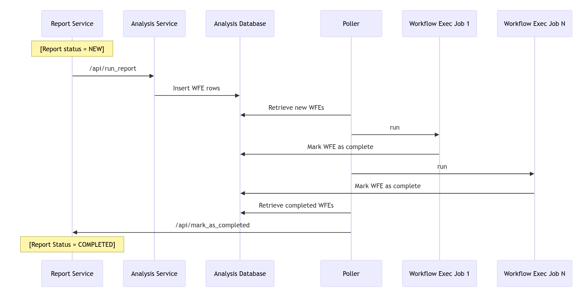
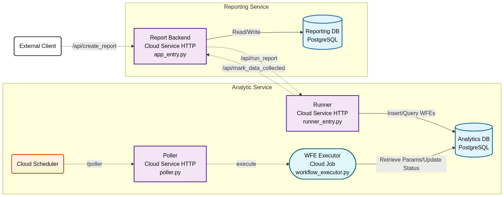

# Gemini Social Sentiment Analyzer

## License and Copyright Notice
> Copyright 2025 Google LLC
>
> Licensed under the Apache License, Version 2.0 (the "License");
> you may not use this file except in compliance with the License.
> You may obtain a copy of the License at
>
>   https://www.apache.org/licenses/LICENSE-2.0
>
> Unless required by applicable law or agreed to in writing, software
> distributed under the License is distributed on an "AS IS" BASIS,
> WITHOUT WARRANTIES OR CONDITIONS OF ANY KIND, either express or implied.
> See the License for the specific language governing permissions and
> limitations under the License.

## Disclaimer

> This project is provided "as is" and without warranty of any kind, express or
> implied, including but not limited to the warranties of merchantability,
> fitness for a particular purpose and non-infringement. In no event shall the
> authors or copyright holders be liable for any claim, damages or other
> liability, whether in an action of contract, tort or otherwise, arising from,
> out of or in connection with the software or the use or other dealings in the
> software.
>
> Please use this software at your own risk. The author(s) are not responsible
> for any legal implications or consequences resulting from the use or misuse of
> this software.
>
> This is not an officially supported Google product. This project is not
> eligible for the [Google Open Source Software Vulnerability Rewards
> Program](https://bughunters.google.com/open-source-security).

## Problem Statement

Many advertisers are well known world wide, where large groups of people express
strong opinions - both good and bad - about their products through social
content. Hence, many advertisers are looking to analyze social media content,
to find the following insights:

* Gauge this user sentiment, to see how it might be affecting their sales.
* Gauge what new features their customers are most interested in seeing added
to their products
* Monitor their respective industry, to help find emerging trends and emerging
competitors.


## Solution Description

This solution creates a platform by which advertisers can mine various social
media content (ie, Youtube videos and comments) to extract both 1) sentiment
scores on each piece of social media content, and 2) a relevancy score on how
much the content relates to the topic being analyzed.

The flow of the solution is as follows:

1. The analyzer identifies a topic (ie, "Foo feature for Bar product"), start
and end date to analyze, what social media content they want to analyze (see
details below), and what output they want (see details below).

2. When the solution runs, it will use publicly avaiable APIs to search for
content related to the topic, within the analysis start and end dates, and
from the specified social media content.

3. The solution will then leverage Google Cloud Platform's (GCP) Vertex AI
batch prediction capabilities to leverage Gemini to analyze all of the found
content.

4. Sentiment data is then written to a BigQuery table, where it can be queried
and analyzed.

## Architecture

### Concepts and Entities

#### Reports, Workflow Executions and Tasks
The core entity in the solution is a Report, representing a complete analysis of
social media content to extract sentiment trends.
A Report is composed of a series of Workflow Executions, each one representing
the work required to generate a sub-set of sentiment data required by a Report.
Sentiment analysis data is divided by 1) social media content types, and 2)
topics.  For example, if a Report is looking to compare sentiment between
Product A (Brand A) and Product B (Brand B) by analyzing YT videos, YT comments
and Reddit posts, then that would result in 6 Workflow executions (2 topics x 3
sources).
Finally, Workflow Executions are composed of Tasks, discrete units of work that
can be executed in a stateless manner, and are chained together.  Each task is
able to access the data outputted by its preceding Task, where it can
process/transform it, and then persist it for use by the next Task.

#### Micro-services
When looking to design the solution, the team decided to frame it as a
software-as-a-service (SAAS) application, where the functionalities of the
solution were broken up into micro-services.   As such, the solution is broken
up into 2 current micro-services, with 1 future service being planned:

1. **Reporting Service.**  Responsible for managing report creation, scheduling
   analysis and packaging results for export.
2. **Analysis Service.**  Responsible for determining how many Workflow
   Executions are required to build the report, what tasks need to be executed
   in each Workflow Execution, and track the status of all running Workflow
   Executions.


### Sequence Diagram - Running Reports


### GCP Architecture


## Project Guidelines & Style Guides

This project enforces strict coding standards and style guidelines to ensure
high code quality and consistency across all services and frontend applications.

The style guides are located in the `docs/style_guides/` directory:
- `docs/style_guides/general.md`: General styling and formatting rules for the
  entire project.
- `docs/style_guides/python.md`: Python-specific rules, including Google Python
  Style Guide, linting with pylint, and unit testing standards.
- `docs/style_guides/typescript.md`: TypeScript and UI standards, covering
  strict typing, Next.js paradigms, and dynamic styling rules.

To assist AI coding assistants in adhering to these standards, we have included
specific dot rules files at the project root:
- `.cursorrules`: Provides project-specific instructions and rules for the
  Cursor IDE.
- `.geminirules`: Provides equivalent project-specific instructions and rules
  for Antigravity (Gemini).

Both files instruct the AI assistants to prioritize and strictly follow the
project's style guides located in the `docs/style_guides/` directory before
writing or modifying any code.

## Deployment Pre-requisites
Whether you're deploying to Google Cloud or locally, you'll need to make sure
you have the following pre-requisites set up:

1. Python 3.12 or higher installed
2. Pip 24.3 or higher installed
3. [Google Cloud CLI](https://docs.cloud.google.com/sdk/docs/install-sdk)
   installed and __authenticated__
4. [Create an API key](https://support.google.com/googleapi/answer/6158862?hl=en)
   for the GCP project you're either going to install Gemini Social Sentiment Analyzer into, or the
   GCP project you'll use for local development.


## Deploying to Google Cloud

### Steps
1. Create or re-use a Google Cloud Project for deploying Gemini Social Sentiment Analyzer to.

2. If the haven't done it already, create an API key within the GCP project
   you're going to install Gemini Social Sentiment Analyzer into.

3. Download the code from the repository.

4. Update the `deploy/terraform/terraform.tfvars` file with the details for your
   project.

   a. Update the `yt_api_key` field with the API key you created in step 2.

   b. Update the `project_id` field with the project ID of the GCP project
      you're installing Gemini Social Sentiment Analyzer onto.

   c. Update the `region` field with the region of the GCP project you're
      installing Gemini Social Sentiment Analyzer onto (ie, "us-central1").

   d. Update the `project_number` field with the project number of the GCP
      project you're installing Gemini Social Sentiment Analyzer onto.

   e. Update the `db_username` field with the username of the database you're
      installing Gemini Social Sentiment Analyzer onto.

   f. Update the `db_password` field with the password of the database you're
      installing Gemini Social Sentiment Analyzer onto.

   g. Update the `bq_dataset_name` field with the name of the BigQuery dataset
      you're installing Gemini Social Sentiment Analyzer onto.

5. Run `deploy/terraform/deploy.sh` with the project ID of the GCP project
   you're installing Gemini Social Sentiment Analyzer onto.

   **Note**: This script will create a temporary virtual environment to install
   necessary build dependencies (`twine`,
   `keyrings.google-artifactregistry-auth`) for publishing the shared library.

   ```bash
   cd deploy
   ./deploy.sh <PROJECT_ID>
   ```
Once completed, you can create and view reports by navigating to the
Reporting UI.  The URL of the deployed Reporting UI is printed to the console
when the deployment completes as a Terraform output variable named
`reporting_ui_url`.

### Troubleshooting

If you run into any issues during the deployment process, please consult the
Troubleshooting Guide.

```bash
cat ./deploy/TROUBLESHOOTING.md
```

## Local Development Workflow

This section outlines the flow for developers working on Gemini Social Sentiment Analyzer,
especially when modifying the shared library or services.


### Prerequisites
1. Choose or create a Google Cloud Platform (GCP) project to use to generate
your sentiment analysis reports.  Make sure it has the following:

  a. It's associated with a billing account

  b. It has the YouTube Data API enabled

  c. It has the Vertex AI API enabled

  d. It has the BigQuery API enabled.

  e. There's an API key created for the project.

### Setting up your local environment

1. If you are running the sentiment analysis code on a Linus/Unix system,
   make sure to authenticate yourself to access the Google Could resources
   using the `gcloud auth login` command.

2. Install and setup a PostgresDB **server** for storing reporting configuration
   data.  *NOTE:* The README files for the other services will outline the
   steps for setting up their respective databases.

3. Open up the [Deployment README](./deploy/README.md)
   file and follow the instructions there to deploy Gemini Social Sentiment
   Analayzer locally.

### Running the workflow executor

When developing locally, you can manually trigger the workflow execution:

1.  **Create a Report**:
    Use the reporting UI to create a report (by default at
    `http://localhost:9002`).

2.  **Get the Execution ID**:
    Connect to the Analysis Database (`social_pulse_db`) and query the
    `WorkflowExecutions` table to find the pending execution for your report.

    ```sql
      SELECT
        executionid, # You need this to run the executor
        reportid,    # You need this to later mark the report as completed
        dataoutputs,
        topic,
        status,
        createdon
      FROM
        workflowexecutionparams
      WHERE
        status = 'NEW'
      ORDER BY createdon DESC
    ```
    *Copy the `executionId`.*

3.  **Run the Workflow Executor**:
    Use the helper script in the Analysis Service to run the specific execution.

    ```bash
    ./services/analysis_service/run_wfe.sh <EXECUTION ID>
    ```

4.  **Mark Report as Completed**:
    Once the workflow is successful, manually notify the Reporting Service that
    the report is ready (normally done by the Poller).

    ```bash
    curl -X POST http://localhost:8008/api/<REPORT ID>/mark_as_completed \
      -H "Content-Type: application/json" \
      -d '[{
        "reportId": "<REPORT ID>",
        "source": "YOUTUBE_VIDEO",
        "dataOutput": "SENTIMENT_SCORE",
        "datasetUri": "bq://<PROJECT_ID>/<DATASET>/SentimentDataset_<EXECUTION ID>"
      }]'
    ```

## FAQ

*Q. What social media content is currently supported?*
*A. Currently only Youtube video and comments are supported, but we are working
    on bringing other content types to the solution.

*Q. What output formats are currently supported?*
*A. Currently, sentiment score and share of voice reports are supported.  In
    addition, you can include justifications (quotes taken directly from the
    social content) in the output for sentiment score reports by setting the
    `include_justifications` flag to true in the request.
