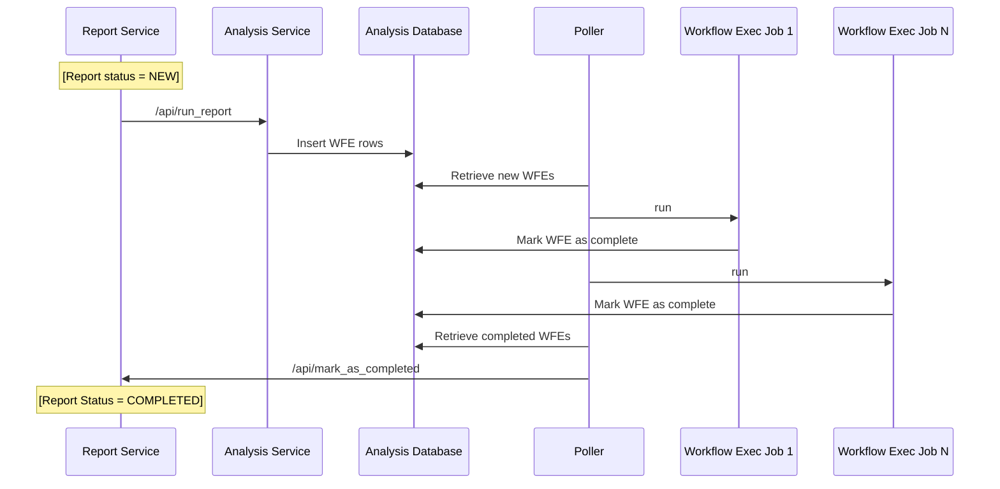
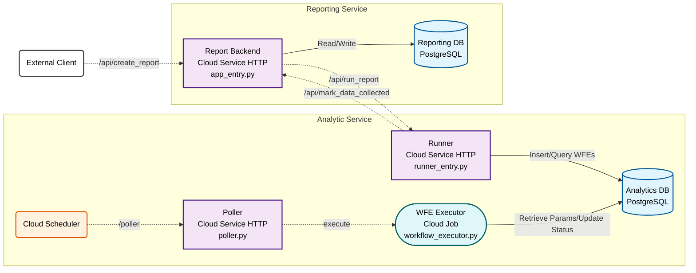

## Report Service - Running Reports Sequence Diagram

```mermaid
sequenceDiagram
    participant RS as Report Service
    participant AS as Analysis Service
    participant ADB as Analysis Database
    participant PL as Poller

    participant W1 as Workflow Exec Job 1
    participant WN as Workflow Exec Job N

    %% Add WFE's for the report
    Note over RS: [Report status = NEW]
    RS->>AS: /api/run_report
    AS->>ADB: Insert WFE rows

    %% Poller starts and monitor executions
    PL->>ADB: Retrieve new WFEs

    PL->>W1: run
    W1->>ADB:Mark WFE as complete

    PL->>WN: run
    WN->>ADB: Mark WFE as complete

    PL->>ADB: Retrieve completed WFEs
    PL->>RS: /api/mark_as_completed
    Note over RS: [Report Status = COMPLETED]
```

## GCP Architecture Diagram

```mermaid
flowchart LR
    %% Styles - Enforcing black text for visibility
    classDef db fill:#e1f5fe,stroke:#01579b,stroke-width:2px,color:#000;
    classDef service fill:#f3e5f5,stroke:#4a148c,stroke-width:2px,color:#000;
    classDef job fill:#e0f7fa,stroke:#006064,stroke-width:2px,color:#000;
    classDef trigger fill:#fff3e0,stroke:#e65100,stroke-width:2px,color:#000;
    classDef client fill:#ffffff,stroke:#333,stroke-width:2px,color:#000;

    %% External Entry
    Client(External Client):::client

    subgraph AS [Analytic Service]
        direction TB
        ADB[(Analytics DB<br>PostgreSQL)]:::db

        %% Updated to Cloud Service (HTTP)
        Runner[Runner<br>Cloud Service HTTP<br>runner_entry.py]:::service

        %% Updated to Cloud Job
        Executor([WFE Executor<br>Cloud Job<br>workflow_executor.py]):::job

        %% Updated to Cloud Service (HTTP)
        Poller[Poller<br>Cloud Service HTTP<br>poller.py]:::service

        Scheduler(Cloud Scheduler):::trigger

        %% Analytic Internal Flows
        Runner -- Insert/Query WFEs --> ADB

        %% Removed "PubSub Message" label
        Scheduler -.->|/poller| Poller

        Poller -.->|execute| Executor
        Executor -- Retrieve Params/Update Status --> ADB
    end

    subgraph RS [Reporting Service]
        direction TB

        %% Updated to Cloud Service (HTTP)
        RBackend[Report Backend<br>Cloud Service HTTP<br>app_entry.py]:::service
        RDB[(Reporting DB<br>PostgreSQL)]:::db

        %% Reporting Internal Flows
        RBackend -- Read/Write --> RDB
    end

    %% Cross-Service Communication (HTTP)
    Client -.->|/api/create_report| RBackend
    RBackend -.->|/api/run_report| Runner
    Runner -.->|/api/mark_data_collected| RBackend
```